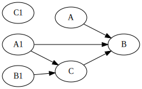
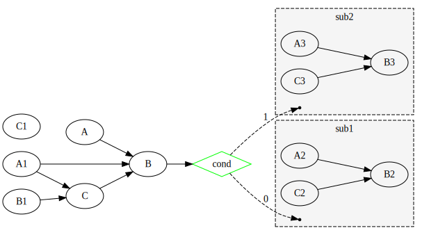
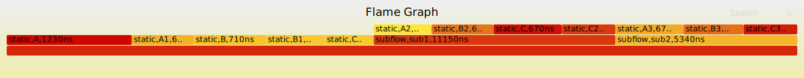

# Go-Taskflow
[](https://codecov.io/github/noneback/go-taskflow)
[](https://pkg.go.dev/github.com/noneback/go-taskflow)
[](https://goreportcard.com/report/github.com/noneback/go-taskflow)
[](https://github.com/avelino/awesome-go)


A static DAG (Directed Acyclic Graph) task computing framework for Go, inspired by [taskflow-cpp](https://github.com/taskflow/taskflow), with Go's native capabilities and simplicity, suitable for complex dependency management in concurrent tasks.

## Feature
- **High extensibility**: Easily extend the framework to adapt to various specific use cases.

- **Native Go's concurrency model**: Leverages Go's goroutines to manage concurrent task execution effectively.

- **User-friendly programming interface**: Simplify complex task dependency management using Go.

- **Static\Subflow\Conditional\Cyclic tasking**: Define static tasks, condition nodes, nested subflows and cyclic flow to enhance modularity and programmability.

	| Static | Subflow | Condition | Cyclic |
	|:-----------|:------------:|------------:|------------:|
	|      |      |       |       |

- **Priority Task Schedule**: Define tasks' priority, higher priority tasks will be scheduled first.

- **Built-in visualization & profiling tools**: Generate visual representations of tasks and profile task execution performance using integrated tools, making debugging and optimization easier.

## Use Cases

- **Data Pipeline**: Orchestrate data processing stages that have complex dependencies.

- **Workflow Automation**: Define and run automation workflows where tasks have a clear sequence and dependency structure.

- **Parallel Tasking**: Execute independent tasks concurrently to fully utilize CPU resources.

## Example
import latest version: `go get -u github.com/noneback/go-taskflow`

https://github.com/noneback/go-taskflow/blob/e2a5d2ead9f29b3601e21626d89b46759bc4a211/examples/conditional/condition.go#L1-L97

## Understand Condition Task Correctly
Condition Node is special in [taskflow-cpp](https://github.com/taskflow/taskflow). It not only enrolls in Condition Control but also in Looping.

Our repo keeps almost the same behavior. You should read [ConditionTasking](https://taskflow.github.io/taskflow/ConditionalTasking.html) to avoid common pitfalls.

## How to use visualize taskflow
```go
if err := gotaskflow.Visualize(tf, os.Stdout); err != nil {
		log.Fatal(err)
}
```
`Visualize` generates raw strings in dot format, use `dot` to draw a DAG svg.


## How to use profile taskflow
```go
if err :=exector.Profile(os.Stdout);err != nil {
		log.Fatal(err)
}
```

`Profile` generates raw strings in flamegraph format, use `flamegraph` to draw a flamegraph svg.



## What's more
Any Features Request or Discussions are all welcomed.
