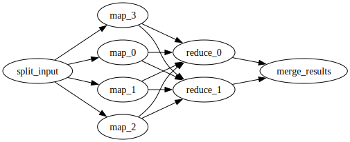
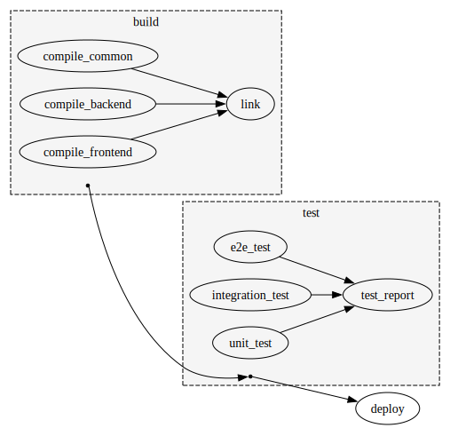
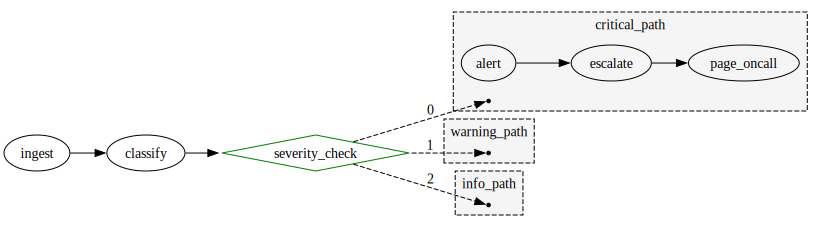
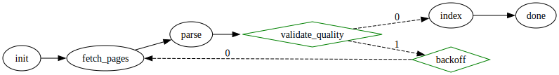
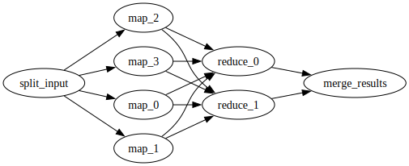
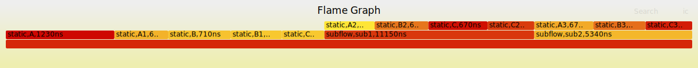

# go-taskflow

[](https://codecov.io/github/noneback/go-taskflow)
[](https://pkg.go.dev/github.com/noneback/go-taskflow)
[](https://goreportcard.com/report/github.com/noneback/go-taskflow)
[](https://github.com/avelino/awesome-go)
[](https://news.ycombinator.com/front?day=2024-11-15)

[![DeepWiki][deepwiki-image]][deepwiki-url]

[deepwiki-url]: https://deepwiki.com/noneback/go-taskflow
[deepwiki-image]: https://img.shields.io/badge/Chat%20with-DeepWiki%20🤖-20B2AA


go-taskflow is a general-purpose task-parallel programming framework for Go, inspired by [taskflow-cpp](https://github.com/taskflow/taskflow). It leverages Go's native capabilities and simplicity, making it ideal for managing complex dependencies in concurrent tasks.

## Features

- **High Extensibility**: Easily extend the framework to adapt to various specific use cases.
- **Native Go Concurrency Model**: Leverages Go's goroutines for efficient concurrent task execution.
- **User-Friendly Programming Interface**: Simplifies complex task dependency management in Go.
- **Static, Subflow, Conditional, and Cyclic Tasking**: Define static tasks, condition nodes, nested subflows, and cyclic flows to enhance modularity and programmability.

    | Static | Subflow | Condition | Cyclic |
    |:-----------|:------------:|------------:|------------:|
    |      |      |       |       |

- **Priority Task Scheduling**: Assign task priorities to ensure higher-priority tasks are executed first.
- **Built-in Visualization, Profiling and Tracing**: Generate visual representations of tasks, profile task execution with flamegraph, and capture Chrome Trace events for timeline analysis.

## Use Cases

- **Data Pipelines**: Orchestrate data processing stages with complex dependencies.
- **AI Agent Workflow Automation**: Define and execute AI agent workflows with clear sequences and dependency structures.
- **Parallel Graph Tasking**: Execute graph-based tasks concurrently to maximize CPU utilization.

## Installation

Import the latest version of go-taskflow using:

```bash
go get -u github.com/noneback/go-taskflow
```

## Documentation

[DeepWiki Page](https://deepwiki.com/noneback/go-taskflow)

## Quick Start

A MapReduce word-count pipeline with parallel mappers, hash-partitioned shuffle, and reducers:

```go
package main

import (
    "fmt"
    "log"
    "os"
    "sort"
    "strings"
    "sync"

    gtf "github.com/noneback/go-taskflow"
)

const (
    numMappers  = 4
    numReducers = 2
)

var (
    mapOutputs [numMappers][numReducers]map[string]int
    mu         sync.Mutex
)

func hashPartition(word string) int {
    h := 0
    for _, c := range word {
        h = 31*h + int(c)
    }
    if h < 0 {
        h = -h
    }
    return h % numReducers
}

func main() {
    input := `the quick brown fox jumps over the lazy dog
the fox and the dog are friends the dog jumps over the fox
brown dog lazy fox the quick brown dog the lazy fox`

    var chunks [numMappers]string
    executor := gtf.NewExecutor(8, gtf.WithProfiler())
    tf := gtf.NewTaskFlow("word-count")

    // Phase 1: Split input into chunks for parallel processing
    splitTask := tf.NewTask("split_input", func() {
        words := strings.Fields(input)
        size := (len(words) + numMappers - 1) / numMappers
        for i := 0; i < numMappers; i++ {
            start, end := i*size, (i+1)*size
            if end > len(words) {
                end = len(words)
            }
            chunks[i] = strings.Join(words[start:end], " ")
        }
    })

    // Phase 2: Map — count words per chunk, partition by hash
    mapTasks := make([]*gtf.Task, numMappers)
    for i := 0; i < numMappers; i++ {
        idx := i
        mapTasks[idx] = tf.NewTask(fmt.Sprintf("map_%d", idx), func() {
            local := [numReducers]map[string]int{}
            for r := 0; r < numReducers; r++ {
                local[r] = make(map[string]int)
            }
            for _, w := range strings.Fields(chunks[idx]) {
                local[hashPartition(w)][w]++
            }
            mu.Lock()
            for r := 0; r < numReducers; r++ {
                mapOutputs[idx][r] = local[r]
            }
            mu.Unlock()
        })
    }
    splitTask.Precede(mapTasks...)

    // Phase 3: Reduce — aggregate each hash partition
    reduceTasks := make([]*gtf.Task, numReducers)
    reduceResults := make([]map[string]int, numReducers)
    for r := 0; r < numReducers; r++ {
        rIdx := r
        reduceResults[rIdx] = make(map[string]int)
        reduceTasks[rIdx] = tf.NewTask(fmt.Sprintf("reduce_%d", rIdx), func() {
            for m := 0; m < numMappers; m++ {
                for word, count := range mapOutputs[m][rIdx] {
                    reduceResults[rIdx][word] += count
                }
            }
        })
    }
    for _, mt := range mapTasks {
        mt.Precede(reduceTasks...)
    }

    // Phase 4: Merge final results
    mergeTask := tf.NewTask("merge_results", func() {
        final := make(map[string]int)
        for r := 0; r < numReducers; r++ {
            for w, c := range reduceResults[r] {
                final[w] += c
            }
        }
        keys := make([]string, 0, len(final))
        for k := range final {
            keys = append(keys, k)
        }
        sort.Strings(keys)
        for _, w := range keys {
            fmt.Printf("%-12s %d\n", w, final[w])
        }
    })
    for _, rt := range reduceTasks {
        rt.Precede(mergeTask)
    }

    executor.Run(tf).Wait()

    if err := tf.Dump(os.Stdout); err != nil {
        log.Fatal(err)
    }
}
```

For more examples, visit the [examples directory](https://github.com/noneback/go-taskflow/tree/main/examples).

## Benchmark

The following benchmarks provide a rough estimate of pure scheduling overhead using empty task functions. Note that most realistic workloads are I/O-bound, and their performance cannot be accurately reflected by these results. For CPU-intensive tasks, consider using [taskflow-cpp](https://github.com/taskflow/taskflow).

Benchmark naming: `N{task_count}-C{concurrency}` where concurrency is goroutine pool size.

```plaintext
$ go test -bench=. -benchmem ./benchmark/
goos: darwin
goarch: arm64
pkg: github.com/noneback/go-taskflow/benchmark
cpu: Apple M4
BenchmarkConcurrent/N8-C10-10              329973       3765 ns/op       994 B/op       46 allocs/op
BenchmarkConcurrent/N8-C40-10              293101       4232 ns/op      1023 B/op       47 allocs/op
BenchmarkConcurrent/N8-C80-10              282382       4282 ns/op      1025 B/op       48 allocs/op
BenchmarkConcurrent/N32-C10-10              82747      14659 ns/op      4384 B/op      177 allocs/op
BenchmarkConcurrent/N32-C40-10              62128      18632 ns/op      4618 B/op      193 allocs/op
BenchmarkConcurrent/N32-C80-10              63214      19002 ns/op      4638 B/op      194 allocs/op
BenchmarkConcurrent/N128-C10-10             18846      61521 ns/op     19299 B/op      698 allocs/op
BenchmarkConcurrent/N128-C40-10             14550      79929 ns/op     20035 B/op      763 allocs/op
BenchmarkConcurrent/N128-C80-10             14028      85004 ns/op     20204 B/op      777 allocs/op
BenchmarkConcurrent/N512-C10-10              4621     250798 ns/op     79518 B/op     2794 allocs/op
BenchmarkConcurrent/N512-C40-10              3685     336991 ns/op     82147 B/op     3045 allocs/op
BenchmarkConcurrent/N512-C80-10              3523     338505 ns/op     82767 B/op     3093 allocs/op
BenchmarkSerial/N8-C10-10                   103927      11773 ns/op      1080 B/op       55 allocs/op
BenchmarkSerial/N8-C40-10                   105153      11625 ns/op      1080 B/op       55 allocs/op
BenchmarkSerial/N32-C10-10                   24338      50010 ns/op      4346 B/op      223 allocs/op
BenchmarkSerial/N32-C40-10                   24327      49822 ns/op      4346 B/op      223 allocs/op
BenchmarkSerial/N128-C10-10                   6091     200769 ns/op     17410 B/op      895 allocs/op
BenchmarkSerial/N128-C40-10                   6040     200494 ns/op     17411 B/op      895 allocs/op
BenchmarkSerial/N512-C10-10                   1484     808528 ns/op     69668 B/op     3583 allocs/op
BenchmarkSerial/N512-C40-10                   1568     809357 ns/op     69669 B/op     3583 allocs/op
BenchmarkDiamond-10                          183015       6605 ns/op       816 B/op       41 allocs/op
BenchmarkDenseLayers/L4xW4-C10-10           109255      11290 ns/op      2421 B/op      107 allocs/op
BenchmarkDenseLayers/L4xW4-C40-10           107066      11000 ns/op      2433 B/op      107 allocs/op
BenchmarkDenseLayers/L4xW8-C10-10            58836      20358 ns/op      5553 B/op      210 allocs/op
BenchmarkDenseLayers/L4xW8-C40-10            56614      20908 ns/op      5639 B/op      215 allocs/op
BenchmarkDenseLayers/L8xW4-C10-10            52110      23374 ns/op      4969 B/op      218 allocs/op
BenchmarkDenseLayers/L8xW4-C40-10            51250      23861 ns/op      4995 B/op      219 allocs/op
BenchmarkDenseLayers/L8xW8-C10-10            27162      42796 ns/op     11628 B/op      429 allocs/op
BenchmarkDenseLayers/L8xW8-C40-10            26202      45285 ns/op     11787 B/op      439 allocs/op
BenchmarkSubflow-10                         191072       9264 ns/op       800 B/op       39 allocs/op
BenchmarkCondition-10                       426183       2805 ns/op       392 B/op       19 allocs/op
BenchmarkLoop/Iter3-10                      127936      10096 ns/op      2257 B/op       90 allocs/op
BenchmarkLoop/Iter5-10                       86608      13919 ns/op      2785 B/op      116 allocs/op
BenchmarkLoop/Iter10-10                      49532      24666 ns/op      4106 B/op      181 allocs/op
BenchmarkConcurrencyScaling/C1-10            93998      13641 ns/op      9471 B/op      328 allocs/op
BenchmarkConcurrencyScaling/C10-10           37479      30258 ns/op      9291 B/op      351 allocs/op
BenchmarkConcurrencyScaling/C40-10           29713      39099 ns/op      9711 B/op      384 allocs/op
BenchmarkGraphBuild/N32-10                  287893       4204 ns/op      6283 B/op      230 allocs/op
BenchmarkGraphBuild/N128-10                  72253      16587 ns/op     24852 B/op      904 allocs/op
BenchmarkGraphBuild/N512-10                  17781      67629 ns/op    101692 B/op     3850 allocs/op
```


## Understanding Conditional Tasks

Conditional nodes in go-taskflow behave similarly to those in [taskflow-cpp](https://github.com/taskflow/taskflow). They participate in both conditional control and looping. To avoid common pitfalls, refer to the [Conditional Tasking documentation](https://taskflow.github.io/taskflow/ConditionalTasking.html).

## Executor Options

`NewExecutor` accepts functional options to configure behavior:

```go
executor := gtf.NewExecutor(1000,
    gtf.WithProfiler(), // enable flamegraph profiling
    gtf.WithTracer(),   // enable Chrome Trace recording
)
```

| Option | Description |
|:---|:---|
| `WithProfiler()` | Enable flamegraph profiling. Required before calling `executor.Profile()`. |
| `WithTracer()` | Enable Chrome Trace recording. Required before calling `executor.Trace()`. |

## Error Handling in go-taskflow

In Go, `errors` are values, and it is the user's responsibility to handle them appropriately. Only unrecovered `panic` events are managed by the framework. If a `panic` occurs, the entire parent graph is canceled, leaving the remaining tasks incomplete. This behavior may evolve in the future. If you have suggestions, feel free to share them.

To prevent interruptions caused by `panic`, you can handle them manually when registering tasks:

```go
tf.NewTask("not interrupt", func() {
    defer func() {
        if r := recover(); r != nil {
            // Handle the panic.
        }
    }()
    // User-defined logic.
})
```

## Visualizing Taskflows

To generate a visual representation of a taskflow, use the `Dump` method:

```go
if err := tf.Dump(os.Stdout); err != nil {
    log.Fatal(err)
}
```

The `Dump` method generates raw strings in DOT format. Use the `dot` tool to create a graph SVG. 



## Profiling Taskflows

To profile a taskflow, first enable the profiler with `WithProfiler()`, then call `Profile`:

```go
executor := gtf.NewExecutor(1000, gtf.WithProfiler())
executor.Run(tf).Wait()

if err := executor.Profile(os.Stdout); err != nil {
    log.Fatal(err)
}
```

The `Profile` method generates raw strings in flamegraph format. Use the `flamegraph` tool to create a flamegraph SVG.



## Tracing Taskflows

To trace a taskflow, first enable the tracer with `WithTracer()`, then call `Trace`:

```go
executor := gtf.NewExecutor(1000, gtf.WithTracer())
executor.Run(tf).Wait()

if err := executor.Trace(os.Stdout); err != nil {
    log.Fatal(err)
}
```

The `Trace` method outputs JSON in [Chrome Trace Event format](https://docs.google.com/document/d/1CvAClvFfyA5R-PhYUmn5OOQtYMH4h6I0nSsKchNAySU). Open it in `chrome://tracing` or [Perfetto UI](https://ui.perfetto.dev/) for visualization.

## Stargazer

[](https://star-history.com/#noneback/go-taskflow&Date)

