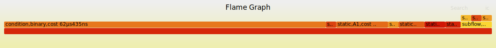

# go-taskflow

[](https://codecov.io/github/noneback/go-taskflow)
[](https://pkg.go.dev/github.com/noneback/go-taskflow)
[](https://goreportcard.com/report/github.com/noneback/go-taskflow)
[](https://github.com/avelino/awesome-go)
[![DeepWiki][deepwiki-image]][deepwiki-url]

[deepwiki-url]: https://deepwiki.com/noneback/go-taskflow
[deepwiki-image]: https://img.shields.io/badge/Chat%20with-DeepWiki%20🤖-20B2AA


go-taskflow is a general-purpose task-parallel programming framework for Go, inspired by [taskflow-cpp](https://github.com/taskflow/taskflow). It leverages Go's native capabilities and simplicity, making it ideal for managing complex dependencies in concurrent tasks.

## Features

- **High Extensibility**: Easily extend the framework to adapt to various specific use cases.
- **Native Go Concurrency Model**: Leverages Go's goroutines for efficient concurrent task execution.
- **User-Friendly Programming Interface**: Simplifies complex task dependency management in Go.
- **Static, Subflow, Conditional, and Cyclic Tasking**: Define static tasks, condition nodes, nested subflows, and cyclic flows to enhance modularity and programmability.

    | Static | Subflow | Condition | Cyclic |
    |:-----------|:------------:|------------:|------------:|
    |      |      |       |       |

- **Priority Task Scheduling**: Assign task priorities to ensure higher-priority tasks are executed first.
- **Built-in Visualization and Profiling Tools**: Generate visual representations of tasks and profile task execution performance using integrated tools, simplifying debugging and optimization.

## Use Cases

- **Data Pipelines**: Orchestrate data processing stages with complex dependencies.
- **AI Agent Workflow Automation**: Define and execute AI agent workflows with clear sequences and dependency structures.
- **Parallel Graph Tasking**: Execute graph-based tasks concurrently to maximize CPU utilization.

## Installation

Import the latest version of go-taskflow using:

```bash
go get -u github.com/noneback/go-taskflow
```

## Example

Below is an example of using go-taskflow to implement a parallel merge sort:

```go
package main

import (
    "fmt"
    "log"
    "math/rand"
    "os"
    "slices"
    "strconv"
    "sync"

    gtf "github.com/noneback/go-taskflow"
)

// mergeInto merges a sorted source array into a sorted destination array.
func mergeInto(dest, src []int) []int {
    size := len(dest) + len(src)
    tmp := make([]int, 0, size)
    i, j := 0, 0
    for i < len(dest) && j < len(src) {
        if dest[i] < src[j] {
            tmp = append(tmp, dest[i])
            i++
        } else {
            tmp = append(tmp, src[j])
            j++
        }
    }

    if i < len(dest) {
        tmp = append(tmp, dest[i:]...)
    } else {
        tmp = append(tmp, src[j:]...)
    }

    return tmp
}

func main() {
    size := 100
    randomArr := make([][]int, 10)
    sortedArr := make([]int, 0, 10*size)
    mutex := &sync.Mutex{}

    for i := 0; i < 10; i++ {
        for j := 0; j < size; j++ {
            randomArr[i] = append(randomArr[i], rand.Int())
        }
    }

    sortTasks := make([]*gtf.Task, 10)
    tf := gtf.NewTaskFlow("merge sort")
    done := tf.NewTask("Done", func() {
        if !slices.IsSorted(sortedArr) {
            log.Fatal("Sorting failed")
        }
        fmt.Println("Sorted successfully")
        fmt.Println(sortedArr[:1000])
    })

    for i := 0; i < 10; i++ {
        sortTasks[i] = tf.NewTask("sort_"+strconv.Itoa(i), func() {
            arr := randomArr[i]
            slices.Sort(arr)
            mutex.Lock()
            defer mutex.Unlock()
            sortedArr = mergeInto(sortedArr, arr)
        })
    }
    done.Succeed(sortTasks...)

    executor := gtf.NewExecutor(1000)

    executor.Run(tf).Wait()

    if err := tf.Dump(os.Stdout); err != nil {
        log.Fatal("Error dumping taskflow:", err)
    }

    if err := executor.Profile(os.Stdout); err != nil {
        log.Fatal("Error profiling taskflow:", err)
    }
}
```

For more examples, visit the [examples directory](https://github.com/noneback/go-taskflow/tree/main/examples).

## Benchmark

The following benchmark provides a rough estimate of performance. Note that most realistic workloads are I/O-bound, and their performance cannot be accurately reflected by these results. For CPU-intensive tasks, consider using [taskflow-cpp](https://github.com/taskflow/taskflow).

```plaintext
$ go test -bench=. -benchmem
goos: linux
goarch: amd64
pkg: github.com/noneback/go-taskflow/benchmark
cpu: Intel(R) Xeon(R) Platinum 8269CY CPU @ 2.50GHz
BenchmarkC32-4    	   22513	     52967 ns/op	    7305 B/op	     227 allocs/op
BenchmarkS32-4    	    6415	    190654 ns/op	    6907 B/op	     255 allocs/op
BenchmarkC6-4     	   58904	     19961 ns/op	    1296 B/op	      47 allocs/op
BenchmarkC8x8-4   	    6810	    169750 ns/op	   16919 B/op	     504 allocs/op
PASS
ok  	github.com/noneback/go-taskflow/benchmark	5.606s
```

## Understanding Conditional Tasks

Conditional nodes in go-taskflow behave similarly to those in [taskflow-cpp](https://github.com/taskflow/taskflow). They participate in both conditional control and looping. To avoid common pitfalls, refer to the [Conditional Tasking documentation](https://taskflow.github.io/taskflow/ConditionalTasking.html).

## Error Handling in go-taskflow

In Go, `errors` are values, and it is the user's responsibility to handle them appropriately. Only unrecovered `panic` events are managed by the framework. If a `panic` occurs, the entire parent graph is canceled, leaving the remaining tasks incomplete. This behavior may evolve in the future. If you have suggestions, feel free to share them.

To prevent interruptions caused by `panic`, you can handle them manually when registering tasks:

```go
tf.NewTask("not interrupt", func() {
    defer func() {
        if r := recover(); r != nil {
            // Handle the panic.
        }
    }()
    // User-defined logic.
})
```

## Visualizing Taskflows

To generate a visual representation of a taskflow, use the `Dump` method:

```go
if err := tf.Dump(os.Stdout); err != nil {
    log.Fatal(err)
}
```

The `Dump` method generates raw strings in DOT format. Use the `dot` tool to create a graph SVG. 

> We also provide a go build tag: `gotaskflow_novis` for those who don't need a visualizer dependency.


## Profiling Taskflows

To profile a taskflow, use the `Profile` method:

```go
if err := executor.Profile(os.Stdout); err != nil {
    log.Fatal(err)
}
```

The `Profile` method generates raw strings in flamegraph format. Use the `flamegraph` tool to create a flamegraph SVG.



## Stargazer

[](https://star-history.com/#noneback/go-taskflow&Date)

