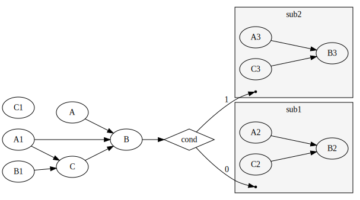

# Go-Taskflow
[](https://codecov.io/github/noneback/go-taskflow)
[](https://pkg.go.dev/github.com/noneback/go-taskflow)
[](https://goreportcard.com/report/github.com/noneback/go-taskflow)
[](https://github.com/avelino/awesome-go)


A static DAG (Directed Acyclic Graph) task computing framework for Go, inspired by taskflow-cpp, with Go's native capabilities and simplicity, suitable for complex dependency management in concurrent tasks.

## Feature
- **High extensibility**: Easily extend the framework to adapt to various specific use cases.

- **Native Go's concurrency model**: Leverages Go's goroutines to manage concurrent task execution effectively.

- **User-friendly programming interface**: Simplify complex task dependency management using Go.

- **Static\Subflow\Conditional tasking**: Define static tasks, condition nodes, and nested subflows to enhance modularity and programmability.

	| Static | Subflow | Condition |
	|:-----------|:------------:|------------:|
	|      |      |       |

- **Built-in visualization & profiling tools**: Generate visual representations of tasks and profile task execution performance using integrated tools, making debugging and optimization easier.

## Use Cases

- **Data Pipeline**: Orchestrate data processing stages that have complex dependencies.

- **Workflow Automation**: Define and run automation workflows where tasks have a clear sequence and dependency structure.

- **Parallel Tasking**: Execute independent tasks concurrently to fully utilize CPU resources.

## Example
import latest version: `go get -u github.com/noneback/go-taskflow`

```go
package main

import (
	"fmt"
	"log"
	"os"
	"runtime"
	"time"

	gotaskflow "github.com/noneback/go-taskflow"
)

func main() {
	// 1. Create An executor
	executor := gotaskflow.NewExecutor(uint(runtime.NumCPU() - 1))
	// 2. Prepare all node you want and arrenge their dependencies in a refined DAG
	tf := gotaskflow.NewTaskFlow("G")
	A, B, C :=
		gotaskflow.NewTask("A", func() {
			fmt.Println("A")
		}),
		gotaskflow.NewTask("B", func() {
			fmt.Println("B")
		}),
		gotaskflow.NewTask("C", func() {
			fmt.Println("C")
		})

	A1, B1, C1 :=
		gotaskflow.NewTask("A1", func() {
			fmt.Println("A1")
		}),
		gotaskflow.NewTask("B1", func() {
			fmt.Println("B1")
		}),
		gotaskflow.NewTask("C1", func() {
			fmt.Println("C1")
		})
	A.Precede(B)
	C.Precede(B)
	A1.Precede(B)
	C.Succeed(A1)
	C.Succeed(B1)

	subflow := gotaskflow.NewSubflow("sub1", func(sf *gotaskflow.Subflow) {
		A2, B2, C2 :=
			gotaskflow.NewTask("A2", func() {
				fmt.Println("A2")
			}),
			gotaskflow.NewTask("B2", func() {
				fmt.Println("B2")
			}),
			gotaskflow.NewTask("C2", func() {
				fmt.Println("C2")
			})
		A2.Precede(B2)
		C2.Precede(B2)
		sf.Push(A2, B2, C2)
	})

	subflow2 := gotaskflow.NewSubflow("sub2", func(sf *gotaskflow.Subflow) {
		A3, B3, C3 :=
			gotaskflow.NewTask("A3", func() {
				fmt.Println("A3")
			}),
			gotaskflow.NewTask("B3", func() {
				fmt.Println("B3")
			}),
			gotaskflow.NewTask("C3", func() {
				fmt.Println("C3")
			})
		A3.Precede(B3)
		C3.Precede(B3)
		sf.Push(A3, B3, C3)
	})

	cond := gotaskflow.NewCondition("binary", func() uint {
		return uint(time.Now().Second() % 2)
	})
	B.Precede(cond)
	cond.Precede(subflow, subflow2)

	// 3. Push all node into Taskflow
	tf.Push(A, B, C)
	tf.Push(A1, B1, C1, cond, subflow, subflow2)
	// 4. Run Taskflow via Executor
	executor.Run(tf).Wait()

	// Visualize dag if you need to check dag execution.
	if err := gotaskflow.Visualize(tf, os.Stdout); err != nil {
		log.Fatal(err)
	}
	// Profile it if you need to see which task is most time-consuming
	if err := executor.Profile(os.Stdout); err != nil {
		log.Fatal(err)
	}
}
```
### How to use visualize taskflow
```go
if err := gotaskflow.Visualize(tf, os.Stdout); err != nil {
		log.Fatal(err)
}
```
`Visualize` generate raw string in dot format, just use dot to draw a DAG svg.


### How to use profile taskflow
```go
if err :=exector.Profile(os.Stdout);err != nil {
		log.Fatal(err)
}
```

`Profile` alse generate raw string in flamegraph format, just use flamegraph to draw a flamegraph svg.


## What's next
- [x] Conditional Tasking
- [x] Task Priority Schedule
- [ ] Taskflow Loop Support
